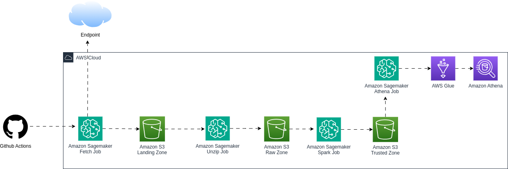

## Project Overview

The pipeline automates the following tasks:

1. **Download Data**: Fetches a ZIP file from a given URL and stores it in the "LND" zone of an S3 bucket.
2. **Unzip Data**: Unzips the data and saves it in the "RAW" zone of the same S3 bucket.
3. **Data Transformation**: Uses PySpark to convert CSV data to Parquet format, partitioning by the "Country" field, and saves the transformed data in the "TRD" zone of the S3 bucket.
4. **Create Athena Database**: Creates a Glue Athena database for querying the processed data.

## Prerequisites

- AWS Account with appropriate permissions to create and manage S3, SageMaker, Glue, and CloudWatch resources.
- Terraform for managing AWS infrastructure.
- Python and AWS SDK (Boto3) for interacting with AWS services.
- SageMaker Notebook or AWS environment to run the pipeline.

## Architecture

- **S3 Buckets**: 
  - `lnd`: Zone for storing the raw data from the URL.
  - `raw`: Zone for unzipped data.
  - `trd`: Zone for storing transformed Parquet data partitioned by "Country".
  
- **SageMaker Pipeline**:
  - A series of steps that execute in sequence to fetch, process, and transform data.
  
- **Glue**:
  - A Glue database is created to enable Athena querying on the processed Parquet data.

## Steps

### 1. Fetch Data from URL
The pipeline first fetches data from the URL: https://eforexcel.com/wp/wp-content/uploads/2020/09/2m-Sales-Records.zip
It stores the ZIP file in the S3 bucket's `lnd` zone.

### 2. Unzip Data
The next step extracts the contents of the ZIP file and saves the data in CSV format to the `raw` zone in S3.

### 3. Convert CSV to Parquet with PySpark
The third step reads the unzipped CSV file, converts it to Parquet format, and partitions the data by the `Country` field. The output is saved in the `trd` zone in S3.

### 4. Create Glue Athena Database
The final step in the pipeline creates a Glue Athena database that allows querying the transformed data stored in the `trd` zone.

## Deployment

1. **Terraform**: Use Terraform scripts to define and deploy the necessary AWS infrastructure (S3, SageMaker, Glue, CloudWatch).
2. **Python SDK**: Deploy the SageMaker pipeline using the Python SDK (`boto3`).

## Logs & Monitoring
All logs for the SageMaker processing jobs are stored in CloudWatch, which provides insights into job progress and any errors that might occur.

## Usage

1. Clone this repository to your local machine.
2. Modify the Terraform scripts with your AWS credentials and specific configurations.
3. Use the Python SDK to deploy the SageMaker pipeline.
4. Monitor the progress of the jobs in CloudWatch.

## License
This project is licensed under the MIT License - see the [LICENSE](LICENSE) file for details.